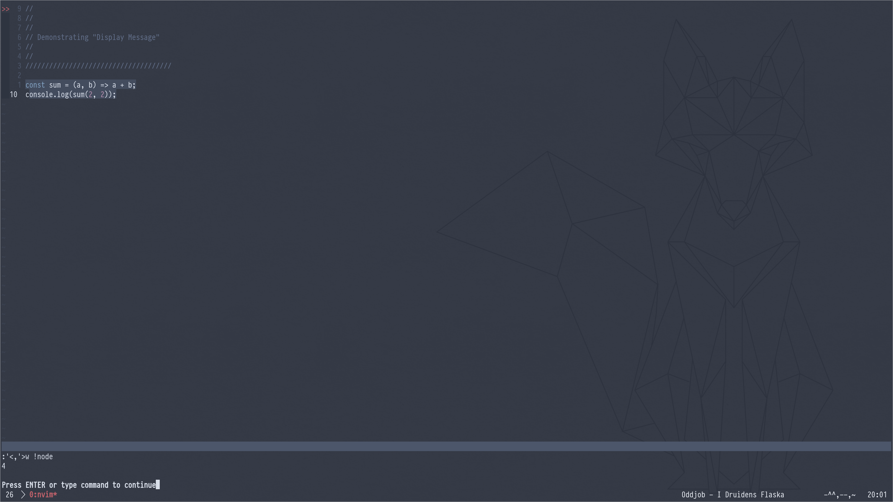

# Display Message
This application display output in a floating window until a key is pressed, useful in a milieu such as X-Monad. A user can interact with the application in two ways, either by sending messages in as cli arguments or by replacing the content in a scratch file.

## Scratch file
A user modifies the content of file `scratch-output` by use of an external application such as Bash. See Vim example for a possible use-case. `./build/fn-res` displays this content in a 800x800 floating window.

## cli
```bash
flags:
-message "{text...}"
-width {int}
-height {int}
-fontsize {int}

./build/msg -message "Hello, world!" -width 500 -heigt 500 -fontsize 15
```


# Background
In Vim it's possible, by visual selection, to evaluate parts* of a code written in an interpreted language. Out of the box, the result from such an operation is outputted in the command window in NeoVim (in contrast to Vim outputting it as a background process at stdout). This is a nice feature, especially since you can mix-in any interpretive language on the fly.



I've only added support for JavaScript and have mapped the display-window to `<leader>i` in visual mode (presuming code is selected).

```vimscript
function! GetResult()
    let result_cmd = system("node ~/Documents/display-message/scratch-output")
    let output = "\n\n" . "==> " . result_cmd
    exec 'call system("echo \"" .
        \ expand(output) . "\" >> ~/Documents/display-message/scratch-output")'
endfunction

vnoremap <leader>i
    :w! ~/Documents/dev/display-message/scratch-output<CR>
    :call GetResult()<CR>
    :!~/Documents/dev/display-message/build/fn-res<CR>
```

This how the evaluation of a few selected lines of JavaScvript is shown:


# Dependencies
I use SDL2 and SDL_TTF, which must be installed if compiled using g++ and the repo make script. Also, you must have the used font.
